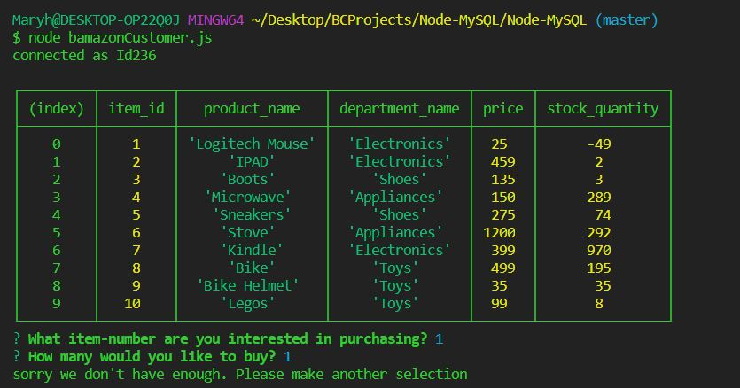

# Node-MySQL

To work with this app, the following are required:

Installation of the following NPM packages:
* Mysql

# CHALLENGE 1

This program is run by typing the following at command line prompt:
node bamazonCustomer.js  

Once the command line is entered, the is shown the contents of the store’s inventory-please see image 1.
The user is prompted to make a selection from the inventory listed. If there is insufficient inventory, the user is advised and asked to make another selection-please see image 2.
Once the selection and quantity required have been provided by the customer, the application updates the inventory to reflect the sale and provide the customer with a receipt of sale-please see image 3.

# Image 1 Bamazon Inventory

# Image 2 Insufficent Stock On-Hand

# Image 3 Completed Sale

